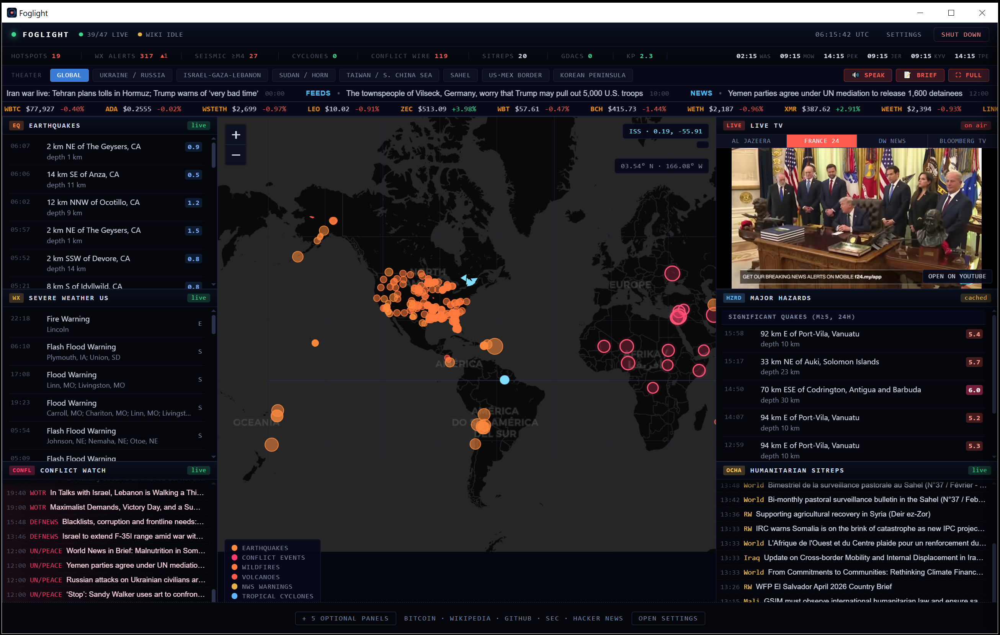

# Foglight


[](LICENSE)

**Foglight** is a local-first desktop situation room for live global events:
earthquakes, severe weather, conflict wires, humanitarian reports, market
tickers, open web activity, and live news video in one dense dashboard.

The Windows release is a **single native desktop `.exe`**. It bundles Python,
the local HTTP server, the WebView desktop shell, and the app UI. End users do
not need Python, WSL, Docker, Git, Node, or a Linux distro installed.

Foglight is MIT licensed and free for everyone to use, modify, distribute, and
build on.

## Screenshots



Additional release screenshots can be placed in:

```text
docs/screenshots/
```

Recommended first set:

- `hero.PNG` - current dashboard hero image
- `dashboard.png` - first launch dashboard
- `live-tv.png` - Live TV panel with a working fallback link visible
- `settings.png` - settings and API key panel
- `map-overlays.png` - hazards, quakes, or conflict overlays active

## What It Does

Foglight watches public data streams and turns them into a single operational
view:

- Global map overlays for earthquakes, hazards, weather, conflict, ISS, fires,
  flights, and ship/air sources when optional keys are configured.
- Live event panels for USGS quakes, NWS alerts, NOAA cyclones, GDACS, EONET,
  ReliefWeb, GDELT, and RSS wires.
- Market and internet pulse panels for Bitcoin, crypto, forex, commodities,
  GitHub, SEC EDGAR, Wikipedia edits, Hacker News, and Reddit.
- Live TV embeds for major news streams, with a YouTube fallback link when an
  embed is blocked.
- Local settings for panel visibility, watchlists, RSS feeds, API keys, and
  ambient audio cues.

## Why It Exists

Foglight is built for people who want a fast, local, no-account overview of
what is happening across the planet: weather risk, earthquakes, conflict wires,
humanitarian updates, public market signals, internet activity, and live video.
It is useful as an OSINT desk, newsroom side monitor, wall display, emergency
awareness screen, or always-on desktop command center.

## Feature Matrix

| Area | Included |
|---|---|
| Desktop release | Single `Foglight.exe`, native WebView2 window, no installer |
| Live map | Dark global map, quake markers, weather polygons, conflict hotspots, hazards, ISS, optional fires/flights/ships |
| Hazard monitoring | USGS earthquakes, volcanoes, NOAA cyclones, GDACS disasters, EONET natural events, NWS alerts, tsunami feeds |
| Conflict and news | GDELT conflict feeds, UN, DW, France 24, BBC, NPR, Al Jazeera, defense/cyber RSS feeds |
| Humanitarian | ReliefWeb situation reports and update stream |
| Markets | Bitcoin mempool/fees/blocks, crypto tickers, forex, commodities, optional FRED/Finnhub keys |
| Internet pulse | GitHub public events, SEC EDGAR filings, Wikipedia edits, Hacker News, Reddit |
| Live TV | Major YouTube live news embeds, default channel setting, external fallback link |
| Local settings | Panel toggles, watchlist, custom RSS feeds, optional API keys, ambient audio toggles |
| Privacy model | Local-only app state, localhost server, masked keys, no Foglight cloud account |

Full details are in [docs/FEATURES.md](docs/FEATURES.md).

## Quick Start

Download the latest release asset:

**[Download Foglight.exe](https://github.com/aivrar/foglight/releases/latest/download/Foglight.exe)**

Release page:

**[github.com/aivrar/foglight/releases/latest](https://github.com/aivrar/foglight/releases/latest)**

Run it:

```text
Foglight.exe
```

That is the normal user path. Foglight starts a local server on `127.0.0.1`,
opens a native WebView window, and stores runtime state under:

```text
%LOCALAPPDATA%\Foglight\
```

Use the in-app **Shut down** button to stop the local server and close the app.

## Requirements

For users:

- Windows 10/11
- Microsoft Edge WebView2 Runtime
- Internet connection for live data feeds
- No admin rights expected
- No system Python required
- No WSL, Docker, Git, or Node required

WebView2 is normally present on modern Windows systems. If WebView startup
fails, Foglight falls back to opening the local dashboard in the default
browser.

## Panels

| Panel | Source | What It Shows |
|---|---|---|
| World Map | Leaflet, CARTO, OpenStreetMap | Global base map and overlays |
| Earthquakes | USGS GeoJSON | Recent seismic activity |
| Severe Weather | NWS api.weather.gov | Active US alerts and polygons |
| Conflict Watch | GDELT, UN, DW, France 24, defense RSS | Conflict-oriented stream |
| Major Hazards | NOAA NHC, GDACS, USGS, EONET | Cyclones, disasters, volcanoes, major quakes |
| Humanitarian Sitreps | ReliefWeb RSS | Humanitarian updates |
| Bitcoin Pulse | mempool.space | Fees, mempool, blocks, difficulty |
| Markets | CoinPaprika, Frankfurter, Stooq | Crypto, forex, commodities |
| News Ticker | Configured RSS feeds | Rolling headline strip |
| Wikipedia Edits | Wikimedia EventStreams | Recent public edits |
| GitHub Pulse | GitHub Events API | Public developer activity |
| SEC EDGAR | SEC Atom feed | Current filings |
| HN + Reddit | Firebase HN API, Reddit JSON | Internet trend panel |
| Live TV | YouTube live embeds | Live news video and external fallback |

See [docs/DATA_SOURCES.md](docs/DATA_SOURCES.md) and
[CREDITS.md](CREDITS.md) for the full source and credit list.

## Optional API Keys

Foglight works without keys, but these optional integrations unlock more map
and market layers:

| Key | Unlocks |
|---|---|
| AISstream | Live global ship positions |
| NASA FIRMS | MODIS/VIIRS near-real-time fire detections |
| OpenSky | Authenticated aircraft data |
| OpenWeatherMap | Global weather extensions |
| FRED | US macro indicators |
| Finnhub | Indices, earnings, market news |

Keys are stored locally under `%LOCALAPPDATA%\Foglight\state\settings.json`.
The settings API masks stored key values before returning them to the UI.

## Project Structure

```text
foglight/
|-- .github/
|   |-- ISSUE_TEMPLATE/
|   `-- pull_request_template.md
|-- assets/
|   |-- foglight.ico
|   `-- foglight-icon.png
|-- docs/
|   |-- screenshots/
|   |-- BUILD_WINDOWS.md
|   |-- DATA_SOURCES.md
|   |-- FEATURES.md
|   |-- FILE_TREE.md
|   |-- RELEASE_CHECKLIST.md
|   `-- REPOSITORY_SETUP.md
|-- web/
|   `-- app.js
|-- build_windows.py
|-- foglight_native.py
|-- foglight_native.spec
|-- foglight_server.py
|-- foglight_spec.md
|-- index.html
|-- requirements-build.txt
|-- CREDITS.md
|-- CHANGELOG.md
|-- CONTRIBUTING.md
|-- SECURITY.md
|-- LICENSE
`-- README.md
```

For a more detailed file map, see [docs/FILE_TREE.md](docs/FILE_TREE.md).

## Build The Single EXE

Build requirements:

- Windows
- Python 3.13+
- Dependencies in [requirements-build.txt](requirements-build.txt)

Build:

```powershell
python -m pip install -r requirements-build.txt
python .\build_windows.py
```

Output:

```text
dist\Foglight.exe
```

The executable is a release artifact and should be attached to GitHub Releases,
not committed to the repository.

Detailed build notes live in [docs/BUILD_WINDOWS.md](docs/BUILD_WINDOWS.md).

## Local Development

Run the server directly:

```powershell
$env:FOGLIGHT_APP_DIR = (Get-Location).Path
$env:FOGLIGHT_CACHE_DIR = "$env:TEMP\foglight-cache"
$env:FOGLIGHT_STATE_DIR = "$env:TEMP\foglight-state"
$env:FOGLIGHT_LOG_DIR = "$env:TEMP\foglight-logs"
python .\foglight_server.py 9787
```

Then open:

```text
http://127.0.0.1:9787/
```

Headless packaged smoke test:

```powershell
$env:FOGLIGHT_NO_BROWSER = "1"
$env:FOGLIGHT_PORT = "19877"
.\dist\Foglight.exe
```

## Security And Privacy

- Native launcher binds the server to `127.0.0.1`.
- State-changing endpoints require same-origin requests.
- RSS proxy rejects localhost and private-network targets.
- API keys are stored only in the local Foglight state directory.
- `/api/settings` returns key status only, not full stored key values.
- No Foglight account or hosted backend is used.

See [SECURITY.md](SECURITY.md) for the disclosure and local-risk notes.

## Release Flow

1. Capture final screenshots and place them under `docs/screenshots/`.
2. Run source checks:

   ```powershell
   python -m py_compile .\foglight_server.py .\foglight_native.py .\build_windows.py
   node --check .\web\app.js
   ```

3. Build the exe:

   ```powershell
   python .\build_windows.py
   ```

4. Smoke test `dist\Foglight.exe`.
5. Create a GitHub Release and upload `dist\Foglight.exe` as `Foglight.exe`.

Full checklist: [docs/RELEASE_CHECKLIST.md](docs/RELEASE_CHECKLIST.md).

## Credits

Foglight stands on public data providers, open-source libraries, and platform
tools. Credits are tracked in [CREDITS.md](CREDITS.md), including Leaflet,
OpenStreetMap, CARTO, PyInstaller, pywebview, Microsoft Edge WebView2,
pythonnet, Pillow, and the public data providers used by the dashboard.

## License

MIT License - free for everyone. See [LICENSE](LICENSE). Third-party services,
libraries, map tiles, and data feeds remain governed by their own licenses and
terms.
