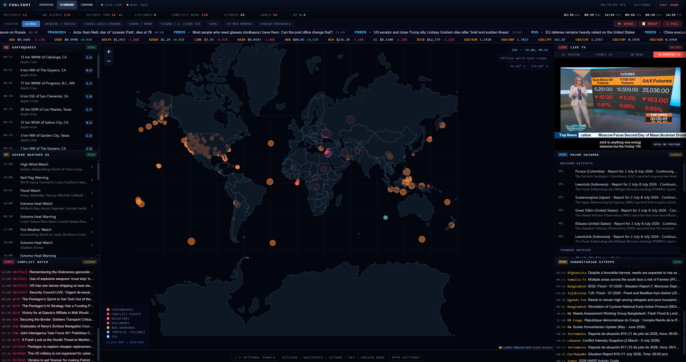
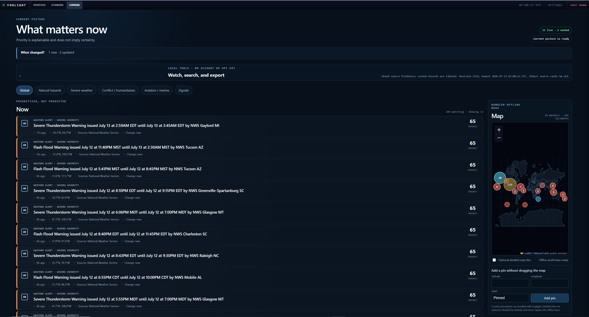

# Foglight

[](https://github.com/aivrar/foglight/releases/latest)
[](https://github.com/aivrar/foglight/releases)
[](https://github.com/aivrar/foglight/actions/workflows/ci.yml)


[](LICENSE)

**Foglight** is a zero-setup, local-first Windows dashboard for live public
events. It brings severe weather, earthquakes, natural hazards, humanitarian
updates, aviation and marine advisories, public signals, and live news into one
fast desktop view.

The release is one portable **`Foglight.exe`**. No installer, account, cloud
backend, or required API key. End users do not need Python, WSL, Docker, Git,
Node, or a Linux distribution.

**[Download the latest Foglight.exe](https://github.com/aivrar/foglight/releases/latest/download/Foglight.exe)**

Foglight is MIT licensed and free to use, modify, distribute, and build on.

## Screenshots

### Overview

Prioritized incidents, explainable scoring, source freshness, local watch tools,
and a bundled offline world map.


### Standard

The original high-density situation room: live map overlays, source rails,
tickers, public-data panels, market context, and live news video.



### Command

A tighter incident-first layout for wall displays and long-running monitoring.



## What It Does

Foglight turns public feeds into three purpose-built views:

- **Overview** prioritizes current incidents with explainable evidence, category
  filters, source health, change tracking, local search, watch regions, and safe
  CSV/GeoJSON export.
- **Standard** provides the dense global map and live source rails for weather,
  earthquakes, hazards, humanitarian reports, public activity, markets, and
  news video.
- **Command** compresses Overview for wall displays and long-running monitoring.
- The bundled Natural Earth base map, cached history, settings, watch regions,
  and pins continue to work when external feeds are unavailable.
- Fourteen canonical public-data providers work without accounts or keys. NASA
  FIRMS remains an optional extra layer for users who already have a key.

## Why It Exists

Foglight is for people who want a fast, local, no-account picture of what is
happening across the planet without assembling APIs or running infrastructure.
It works as a newsroom side monitor, severe-weather and hazard display,
humanitarian-awareness screen, wall display, or always-on desktop dashboard.

## Feature Matrix

| Area | Included |
|---|---|
| Desktop release | Single `Foglight.exe`, native WebView2 window, no installer |
| Overview | Prioritized incidents, category filters, change summaries, source health, watch regions, search, export, and incident timelines |
| Command | Compact incident-first density for wall displays and continuous monitoring |
| Live map | Dark global map, quake markers, weather polygons, conflict hotspots, hazards, ISS, aviation advisories, and optional fires |
| Hazard monitoring | USGS earthquakes, volcanoes, NOAA cyclones, GDACS disasters, EONET natural events, NWS alerts, tsunami feeds, and NOAA SIGMETs |
| Current events and news | UN, DW, France 24, BBC, NPR, Al Jazeera, and configurable RSS feeds |
| Humanitarian | ReliefWeb situation reports and update stream |
| Markets | Bitcoin mempool/fees/blocks, crypto tickers, forex, and conditional commodity futures |
| Internet pulse | GitHub public events, SEC EDGAR filings, Wikipedia edits, Hacker News, Reddit |
| Live TV | Major YouTube live news embeds, default channel setting, external fallback link |
| Local tools | Watch regions, keyword migration, pins, local search, CSV/GeoJSON export, notification preferences, and custom RSS feeds |
| Privacy model | Local-only app state, loopback server, masked optional keys, no Foglight cloud account |

Full details are in [docs/FEATURES.md](docs/FEATURES.md).

## Quick Start

Download the latest verified release asset:

**[Download Foglight.exe](https://github.com/aivrar/foglight/releases/latest/download/Foglight.exe)**

Release page:

**[github.com/aivrar/foglight/releases/latest](https://github.com/aivrar/foglight/releases/latest)**

Run it:

```text
Foglight.exe
```

That is the normal user path. Foglight starts a local server on `127.0.0.1`,
opens a native WebView window, and stores runtime state under:

```text
%LOCALAPPDATA%\Foglight\
```

Use the window close control or the in-app **Shut down** button to stop the
local server and close the app. The release page includes `SHA256SUMS.txt` for
artifact verification and records whether the build is publisher-signed.

## Requirements

For users:

- Windows 10/11
- Microsoft Edge WebView2 Runtime
- Internet connection for live data feeds
- No admin rights expected
- No system Python required
- No WSL, Docker, Git, or Node required

WebView2 is normally present on modern Windows systems. If WebView startup
fails, Foglight falls back to opening the local dashboard in the default
browser.

## Panels

| Panel | Source | What It Shows |
|---|---|---|
| World Map | Bundled Leaflet and Natural Earth; optional OpenStreetMap tiles | Offline global base map and overlays |
| Earthquakes | USGS GeoJSON | Recent seismic activity |
| Severe Weather | NWS api.weather.gov | Active US alerts and polygons |
| Conflict Watch | UN, DW, France 24, defense RSS | Conflict-oriented stream |
| Major Hazards | NOAA NHC, GDACS, USGS, Smithsonian GVP, tsunami.gov | Cyclones, disasters, volcanoes, tsunami notices, major quakes |
| Humanitarian Sitreps | ReliefWeb RSS | Humanitarian updates |
| Bitcoin Pulse | mempool.space | Fees, mempool, blocks, difficulty |
| Markets | CoinPaprika and Frankfurter; conditional Yahoo compatibility | Crypto, forex, and optional commodity futures |
| News Ticker | Configured RSS feeds | Rolling headline strip |
| Wikipedia Edits | Wikimedia EventStreams | Recent public edits |
| GitHub Pulse | GitHub Events API | Public developer activity |
| SEC EDGAR | SEC Atom feed | Current filings |
| HN + Reddit | Firebase HN API, Reddit RSS | Internet trend panel |
| Live TV | YouTube live embeds | Live news video and external fallback |

See [docs/DATA_SOURCES.md](docs/DATA_SOURCES.md) and
[CREDITS.md](CREDITS.md) for the full source and credit list.

## Optional API Key

Foglight works without keys. One optional integration unlocks an additional
map layer:

| Key | Unlocks |
|---|---|
| NASA FIRMS | MODIS/VIIRS near-real-time fire detections |

The key is stored locally under `%LOCALAPPDATA%\Foglight\state\settings.json`.
The settings API masks its value before returning settings to the UI.

## Project Structure

```text
foglight/
|-- .github/              # Windows CI, signed-release workflow, templates
|-- assets/               # Windows icon and generated version metadata
|-- config/               # Versioned provider registry and bounded datasets
|-- docs/                 # Architecture, sources, screenshots, release evidence
|-- foglight_core/        # Models, providers, scheduler, storage, correlation
|-- scripts/              # Smoke tests, diagnostics, baselines, secret scan
|-- tests/                # Python, JavaScript, browser, visual, packaged tests
|-- web/                  # Overview, Standard, Command, maps, watches, settings
|-- build_windows.py
|-- foglight_native.py
|-- foglight_native.spec
|-- foglight_server.py
|-- index.html
|-- requirements-build.txt
|-- requirements-dev.txt
|-- pyproject.toml
`-- README.md
```

For a more detailed file map, see [docs/FILE_TREE.md](docs/FILE_TREE.md).

## Architecture And Audit Record

The researched architecture and gated execution tasklist for the incident-based
Overview, timeline, offline map, and additional keyless providers are kept in:

- [V2 planning research](docs/FOGLIGHT_V2_PLANNING_RESEARCH.md)
- [V2 phased execution plan](docs/FOGLIGHT_V2_EXECUTION_PLAN.md)

These documents are the research, phased implementation, and independent audit
record for the features present in this source tree. Current release evidence
is summarized in [docs/RELEASE_EVIDENCE.md](docs/RELEASE_EVIDENCE.md).

## Build From Source

End users can download `Foglight.exe` from Releases and run it without Python.
The steps below are for rebuilding the executable from source.

Developer build requirements:

- Windows
- Python 3.13+
- Dependencies in [requirements-build.txt](requirements-build.txt)

Build:

```powershell
python -m venv .venv
.\.venv\Scripts\python.exe -m pip install -r requirements-build.txt
.\.venv\Scripts\python.exe .\build_windows.py
```

Output:

```text
dist\Foglight.exe
```

The executable is a release artifact and should be attached to GitHub Releases,
not committed to the repository.

Detailed build notes live in [docs/BUILD_WINDOWS.md](docs/BUILD_WINDOWS.md).

## Local Development

Run the server directly:

```powershell
$env:FOGLIGHT_APP_DIR = (Get-Location).Path
$env:FOGLIGHT_CACHE_DIR = "$env:TEMP\foglight-cache"
$env:FOGLIGHT_STATE_DIR = "$env:TEMP\foglight-state"
$env:FOGLIGHT_LOG_DIR = "$env:TEMP\foglight-logs"
python .\foglight_server.py 9787
```

Then open:

```text
http://127.0.0.1:9787/
```

Headless packaged smoke test:

```powershell
$env:FOGLIGHT_NO_BROWSER = "1"
$env:FOGLIGHT_PORT = "19877"
.\dist\Foglight.exe
```

## Security And Privacy

- Native launcher binds the server to `127.0.0.1`.
- State-changing endpoints require an ephemeral per-launch token.
- Host validation blocks DNS-rebinding origins.
- RSS proxy rejects localhost/private-network targets and revalidates redirects.
- API keys are stored only in the local Foglight state directory.
- `/api/settings` returns key status only, not full stored key values.
- Cache filenames are hashed and key-bearing URLs are redacted from logs/errors.
- Browser responses use a restrictive Content Security Policy; the reviewed Leaflet runtime is bundled locally.
- No Foglight account or hosted backend is used.

See [SECURITY.md](SECURITY.md) for the disclosure and local-risk notes.

## Release Flow

1. Capture final screenshots and place them under `docs/screenshots/`.
2. Run source checks:

   ```powershell
   .\.venv\Scripts\python.exe -m ruff check .
   .\.venv\Scripts\python.exe -m pytest -q
   node --check .\web\app.js
   npm run test:js
   npm run test:browser
   .\.venv\Scripts\python.exe -m pip_audit -r .\requirements-build.txt
   ```

3. Build the exe:

   ```powershell
   .\.venv\Scripts\python.exe .\build_windows.py
   ```

4. Run both packaged release smoke scripts from the release checklist.
5. Record whether the artifact is signed or unsigned. Publishers with a trusted
   code-signing identity may use `--require-signature`; users never need one.
6. Create a GitHub Release and upload `dist\Foglight.exe` plus
   `dist\SHA256SUMS.txt`.

Full checklist: [docs/RELEASE_CHECKLIST.md](docs/RELEASE_CHECKLIST.md).

## Credits

Foglight stands on public data providers, open-source libraries, and platform
tools. Credits are tracked in [CREDITS.md](CREDITS.md), including Leaflet,
Natural Earth, OpenStreetMap, PyInstaller, pywebview, Microsoft Edge WebView2,
pythonnet, Pillow, and the public data providers used by the dashboard.

## License

MIT License - free for everyone. See [LICENSE](LICENSE). Third-party services,
libraries, map tiles, and data feeds remain governed by their own licenses and
terms.
